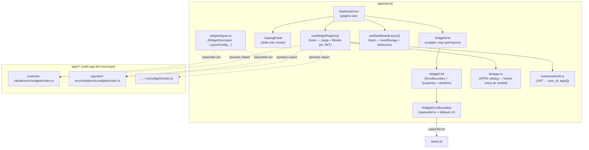

# Design Document — Dashboard Widgets

## Overview

El Dashboard del Portal Ambientalia evoluciona de un directorio estático de enlaces a un panel de control operativo con widgets configurables. El Portal actúa como **host/grid**: orquesta el montaje de componentes React exportados por cada app del monorepo, permite al usuario moverlos, redimensionarlos y persistir su configuración en `localStorage`, y respeta el modelo de permisos JWT existente.

### Principios de diseño

- **El Portal no conoce los internos de cada widget.** Cada app es responsable de su propio componente.
- **Contrato explícito en TypeScript.** `WidgetDescriptor` es la única frontera de acoplamiento entre una app y el Portal.
- **Permisos por JWT.** Solo se cargan módulos de widgets de apps incluidas en el claim `apps` del JWT del usuario actual.
- **Aislamiento de fallos.** Cada widget vive en su propio `ErrorBoundary` y se carga con `React.lazy`; un fallo en un widget no afecta al resto del grid.
- **Persistencia ligera por usuario.** `localStorage` con clave `dashboard_layout_{user_id}` — suficiente para MVP sin backend adicional.
- **Compatibilidad con el directorio estático.** El directorio de apps existente se mantiene como sección colapsable secundaria cuando hay widgets anclados.


## Architecture

### Component architecture diagram



### Data flow

```
JWT (localStorage)
  └─► useAuth()                    → { user_id, apps: string[] }
        └─► useWidgetRegistry()    → WidgetDescriptor[]  (filtrado por apps[])
              └─► dynamic import   → módulos de widgets de cada app permitida
                    └─► WidgetDescriptor[] agregados

useDashboardLayout(user_id)        → { layout, anchoredIds, addWidget, removeWidget, onLayoutChange }
  └─► localStorage                 (clave: dashboard_layout_{user_id})
  └─► debounce 2s                  (persistencia tras cambio)

Dashboard
  ├─► WidgetGrid (react-grid-layout, 12 cols, rowHeight 80)
  │     └─► WidgetCell × N
  │           ├─► WidgetErrorBoundary
  │           └─► React.lazy(widget.component)
  └─► CatalogPanel (muestra descriptores no anclados)
```


## Components and Interfaces

### Estructura de archivos nuevos

```
apps/portal/src/
  widgets/
    types.ts                    ← WidgetDescriptor, WidgetSize, LayoutConfig, LayoutItem
    registry.ts                 ← mapa appId → factory de import dinámico
  hooks/
    useWidgetRegistry.ts        ← carga asíncrona + filtrado por JWT
    useDashboardLayout.ts       ← persistencia localStorage + debounce
  components/
    WidgetGrid.tsx              ← wrapper react-grid-layout
    WidgetCell.tsx              ← Suspense + skeleton + WidgetErrorBoundary
    WidgetErrorBoundary.tsx     ← class component, captureError, fallback UI
    CatalogPanel.tsx            ← slide-over, lista widgets no anclados
    WidgetSkeleton.tsx          ← placeholder durante lazy load
  pages/
    Dashboard.tsx               ← modificado (existente)

apps/customer-valuation/src/
  widgets/
    index.ts                    ← ejemplo de implementación del contrato

apps/payment-reconciliation/src/
  widgets/
    index.ts                    ← ejemplo de implementación del contrato
```

### Contrato que cada app debe implementar

Cada app que quiera exponer widgets crea `src/widgets/index.ts`:

```typescript
// src/widgets/index.ts  (ejemplo en customer-valuation)
import type { WidgetDescriptor } from '../../../portal/src/widgets/types';

// El componente se importa normalmente; el Portal lo envuelve en React.lazy
import SummaryWidget from './SummaryWidget';
import MatrixWidget from './MatrixWidget';

const widgets: WidgetDescriptor[] = [
  {
    id: 'customer-valuation-summary',
    appId: 'customer-valuation',
    name: 'Resumen Valoración',
    description: 'KPIs consolidados de scoring de valor y riesgo por cliente.',
    defaultSize: { w: 4, h: 3 },
    component: SummaryWidget,
  },
  {
    id: 'customer-valuation-matrix',
    appId: 'customer-valuation',
    name: 'Matriz Valor vs Pagos',
    description: 'Scatter plot de segmentación Premium / Condicionado / Estándar / Restringido.',
    defaultSize: { w: 6, h: 4 },
    component: MatrixWidget,
  },
];

export default widgets;
```

> **Regla:** el campo `component` es el componente React ya importado (no un `React.lazy`). El Portal se encarga del lazy-wrapping en `WidgetCell`. El componente puede usar sus propios hooks de carga de datos — no recibe props de datos externos del Portal.


### `useWidgetRegistry` — diseño del hook

```typescript
// hooks/useWidgetRegistry.ts

type RegistryState =
  | { status: 'loading' }
  | { status: 'ready'; widgets: WidgetDescriptor[] }
  | { status: 'error'; message: string };

export function useWidgetRegistry(): RegistryState;
```

**Lógica interna:**

1. Lee `apps[]` del JWT via `useAuth()`.
2. Si `apps` está vacío (JWT ausente / expirado / sin claim) → devuelve `{ status: 'ready', widgets: [] }`.
3. Filtra `APPS` del catálogo para obtener solo las apps asignadas que tengan una entrada en el mapa de factories (`registry.ts`).
4. Lanza un `Promise.allSettled` con el import dinámico de cada módulo.
5. Timeout de 10 s implementado con `Promise.race` contra un `setTimeout` que rechaza.
6. Para cada módulo cargado:
   - Si la promesa rechaza → log de error, omite esa app.
   - Si el módulo no exporta un array → log de error, omite.
   - Por cada descriptor del array: valida que `component` sea una función/clase React; si no, lo omite con log de error.
   - Deduplica por `id`: conserva la primera ocurrencia, descarta duplicados con advertencia.
7. Si el timeout se dispara antes de que todos los módulos respondan → `{ status: 'error', message: '...' }`.
8. Si todos los módulos terminan (aunque algunos fallen) → `{ status: 'ready', widgets: [...] }`.
9. Se re-ejecuta cuando cambia `apps` (efecto con dependencia en `apps`).

**`registry.ts` — mapa de factories:**

```typescript
// widgets/registry.ts
// Registra las factories de import dinámico para cada appId.
// Añadir una nueva app = añadir una línea aquí.

export const WIDGET_FACTORIES: Record<string, () => Promise<{ default: WidgetDescriptor[] }>> = {
  'customer-valuation':      () => import('../../customer-valuation/src/widgets/index'),
  'payment-reconciliation':  () => import('../../payment-reconciliation/src/widgets/index'),
  'customer-profitability':  () => import('../../customer-profitability/src/widgets/index'),
  'inventory-optimization':  () => import('../../inventory-optimization/src/widgets/index'),
  'inventory-consolidation': () => import('../../inventory-consolidation/src/widgets/index'),
  'product-sales':           () => import('../../product-sales/src/widgets/index'),
  'laboratorios-ambientales':() => import('../../laboratorios-ambientales/src/widgets/index'),
  'WO-sales':                () => import('../../WO-sales/src/widgets/index'),
};
```

> **Decisión:** usar `registry.ts` como punto de registro explícito (en lugar de globbing en tiempo de build) mantiene la compatibilidad con Vite/Rollup, que requiere que los imports dinámicos sean analizables estáticamente para chunk splitting. Añadir una nueva app solo requiere una línea en este archivo.

### `useDashboardLayout` — diseño del hook

```typescript
// hooks/useDashboardLayout.ts

export interface DashboardLayoutHook {
  /** Items del layout actualmente anclados. */
  layoutItems: LayoutItem[];
  /** IDs de widgets anclados (para filtrar el CatalogPanel). */
  anchoredWidgetIds: Set<string>;
  /** Añade un widget al grid en la primera posición libre disponible. */
  addWidget: (descriptor: WidgetDescriptor) => void;
  /** Elimina un widget del grid. */
  removeWidget: (widgetId: string) => void;
  /** Callback para el evento onLayoutChange de react-grid-layout. */
  onLayoutChange: (newLayout: ReactGridLayout.Layout[]) => void;
  /** Error de persistencia (null si no hay error). */
  persistError: string | null;
}

export function useDashboardLayout(userId: string | null): DashboardLayoutHook;
```

**Lógica interna:**

1. **Inicialización:** Lee `localStorage.getItem('dashboard_layout_' + userId)` y hace `JSON.parse`. Si el parse falla, el valor no tiene campo `widgets` (array) o `version` (número), inicializa con estado vacío sin mostrar error.
2. **Reconciliación con widgets disponibles:** en `useEffect`, filtra los `layoutItems` para eliminar aquellos cuyo `widgetId` no esté en el set de widgets disponibles del registry. Esto cubre el Req 5.3 (apps desasignadas).
3. **Debounce de 2 s:** usa `useRef` para mantener el timer. Cada vez que el estado cambia, cancela el timer anterior y arranca uno nuevo. Al dispararse, intenta `localStorage.setItem`. Si falla, activa `persistError`.
4. **`addWidget`:** busca la primera posición libre en el grid (algoritmo de packing: itera filas hasta encontrar espacio disponible para `w × h` del `defaultSize`).
5. **`removeWidget`:** filtra `layoutItems` por `widgetId`.
6. **`onLayoutChange`:** actualiza `layoutItems` con las nuevas coordenadas de `react-grid-layout` e inicia el debounce.
7. `userId === null` → devuelve estado vacío sin intentar acceder a localStorage.


### `WidgetGrid` — diseño del componente

```typescript
// components/WidgetGrid.tsx

interface WidgetGridProps {
  layoutItems: LayoutItem[];
  widgets: WidgetDescriptor[];   // descriptores de los widgets anclados
  editMode: boolean;
  onLayoutChange: (newLayout: ReactGridLayout.Layout[]) => void;
  onRemoveWidget: (widgetId: string) => void;
}

export function WidgetGrid(props: WidgetGridProps): JSX.Element;
```

**Detalles de implementación:**

- Usa `<ResponsiveGridLayout>` de `react-grid-layout` con `breakpoints={{ lg: 1200, md: 996, sm: 768, xs: 480, xxs: 0 }}` y `cols={{ lg: 12, md: 12, sm: 12, xs: 12, xxs: 12 }}`.
- `rowHeight={80}`, `isDraggable={editMode}`, `isResizable={editMode}`.
- Para cada `LayoutItem` busca el descriptor correspondiente por `widgetId` y renderiza un `<WidgetCell>`.
- El data-grid de cada item: `{ i: widgetId, x, y, w, h, minW: 2, minH: 2, maxW: 12, maxH: 10 }`.
- En viewport < 768px (`sm` breakpoint): el `ResponsiveGridLayout` aplica automáticamente `cols.sm = 12` a todos los items, apilándolos. No se necesita lógica adicional — react-grid-layout lo maneja.
- CSS de `react-grid-layout` se importa en el entry point del Portal (`main.tsx` o en el componente).
- En modo edición, cada celda muestra un anillo `ring-2 ring-blue-400` y el handle de resize nativo de react-grid-layout.

### `WidgetCell` — diseño del componente

```typescript
// components/WidgetCell.tsx

interface WidgetCellProps {
  descriptor: WidgetDescriptor;
  editMode: boolean;
  onRemove: () => void;
}

export function WidgetCell(props: WidgetCellProps): JSX.Element;
```

**Detalles de implementación:**

- Envuelve el widget en `<WidgetErrorBoundary widgetId={descriptor.id} appId={descriptor.appId}>`.
- Dentro del boundary, usa `<Suspense fallback={<WidgetSkeleton />}>`.
- El componente lazy se crea con `React.lazy(() => Promise.resolve({ default: descriptor.component }))`.
  - Decisión: el componente ya está importado en el descriptor (no es una factory), pero se envuelve en `React.lazy` para diferir el montaje y obtener el fallback de Suspense. Esto simula lazy loading a nivel de montaje; el código del módulo ya está en el bundle del chunk de la app.
  - Para lazy loading real del código de los widgets, la factory del import dinámico en `registry.ts` garantiza que el módulo de widgets completo solo se descarga cuando se solicita.
- En `editMode`, renderiza un botón `×` en la esquina superior derecha con `position: absolute; top: 4px; right: 4px`.
- `WidgetSkeleton` es un `<div>` con `animate-pulse bg-gray-200 rounded-2xl w-full h-full`.

### `WidgetErrorBoundary` — diseño del componente

```typescript
// components/WidgetErrorBoundary.tsx

interface WidgetErrorBoundaryProps {
  widgetId: string;
  appId: string;
  widgetName?: string;
  children: ReactNode;
}

interface WidgetErrorBoundaryState {
  hasError: boolean;
  error: Error | null;
}

export class WidgetErrorBoundary extends Component<
  WidgetErrorBoundaryProps,
  WidgetErrorBoundaryState
> { ... }
```

**Detalles de implementación:**

- `componentDidCatch(error, info)`: invoca `captureError(error)` con contexto enriquecido. Como `captureError` acepta `unknown`, se pasa el error directamente. El contexto `{ widgetId, appId }` se pasa como segundo argumento a `Sentry.withScope` internamente (se puede extender `captureError` en `sentry.ts` para aceptar contexto, o usar `Sentry.setContext` antes de capturar).
- Fallback UI: tarjeta con fondo `bg-red-50 border border-red-200 rounded-2xl p-4`, muestra el nombre del widget (si disponible), un icono de error de `lucide-react` (`AlertTriangle`), y el mensaje del error.
- No desmonta ni afecta a los siblings — es un boundary por widget.

### `CatalogPanel` — diseño del componente

```typescript
// components/CatalogPanel.tsx

interface CatalogPanelProps {
  open: boolean;
  onClose: () => void;
  availableWidgets: WidgetDescriptor[];   // widgets no anclados todavía
  onAddWidget: (descriptor: WidgetDescriptor) => void;
}

export function CatalogPanel(props: CatalogPanelProps): JSX.Element;
```

**Detalles de implementación:**

- Implementado como slide-over (panel lateral derecho) usando un `<div>` con `fixed inset-y-0 right-0 w-80 bg-white shadow-xl z-50 transform transition-transform`.
- Lista los `availableWidgets` agrupados por `appId`, mostrando nombre, descripción y `defaultSize` de cada uno.
- Cada widget tiene un botón "Añadir" que llama `onAddWidget(descriptor)` y cierra el panel.
- Si `availableWidgets.length === 0`, muestra un mensaje "No hay más widgets disponibles para añadir."
- Overlay semitransparente detrás para cerrar al hacer click fuera.


### `Dashboard.tsx` — modificaciones al componente existente

El componente actual es reemplazado por una versión extendida que:

1. **Consume `useWidgetRegistry()`** para obtener los descriptores disponibles y el estado de carga.
2. **Consume `useDashboardLayout(user_id)`** para gestionar el layout.
3. **Estado local:** `editMode: boolean`, `catalogOpen: boolean`, `confirmDelete: string | null` (widgetId), `directorioExpanded: boolean` (persiste en localStorage bajo clave `dashboard_apps_expanded_{user_id}`).
4. **Lógica de layout:**
   - Cuando `registryState.status === 'loading'` → muestra spinner/skeleton.
   - Cuando `registryState.status === 'error'` → muestra banner de error.
   - Cuando `registryState.status === 'ready'` → reconcilia el layout (filtra widgets cuyo `appId` ya no está en el registry) y renderiza.
5. **Estructura del render:**

```
<main>
  <header>  ← preservado: bienvenida, búsqueda, campanita
  
  {/* Controles del dashboard (solo en modo auth) */}
  <div class="dashboard-controls">
    <button "Editar Dashboard" → toggleEditMode>
    {editMode && <button "Añadir Widget" → openCatalog>}
    {persistError && <ErrorBanner>}
  </div>

  {/* Grid de widgets o estado vacío */}
  {anchoredWidgetIds.size === 0 
    ? <EmptyGridState onAddClick={openCatalog} />
    : <WidgetGrid ... />
  }

  {/* Directorio de apps existente (colapsable cuando hay widgets) */}
  {anchoredWidgetIds.size > 0 
    ? <CollapsibleSection expanded={directorioExpanded} onToggle={...}>
        <AppsDirectory />
      </CollapsibleSection>
    : <AppsDirectory expanded />  ← expandido por defecto cuando grid vacío
  }

  <footer>  ← preservado: stats del sistema
  
  {/* Modales */}
  <CatalogPanel open={catalogOpen} ... />
  {confirmDelete && <ConfirmDeleteDialog onConfirm={...} onCancel={...} />}
</main>
```

6. **Confirmación de eliminación:** un dialog inline simple (`<dialog>` nativo o `<div>` modal) que pregunta "¿Eliminar widget X?" con botones "Cancelar" y "Eliminar".
7. **Manejo del error de persistencia (Req 3.5, 4.7):**
   - Para el caso normal (Req 3.5): muestra toast de error, no revierte el estado visual.
   - Para el caso de eliminación (Req 4.7): si el setItem falla, revierte el widget al grid y muestra toast.
   - Distinción implementada via un flag `revertOnPersistError` en el hook.


## Data Models

### `widgets/types.ts` — interfaces completas

```typescript
import type { ComponentType } from 'react';

// ─── Dimensiones de un widget ────────────────────────────────────────────────

/** Ancho y alto en unidades de columnas/filas del grid. w y h ∈ [1, 12]. */
export interface WidgetSize {
  w: number;  // columnas
  h: number;  // filas
}

/** Valida que un WidgetSize sea un par de enteros en [1, 12]. */
export function isValidWidgetSize(size: unknown): size is WidgetSize {
  if (!size || typeof size !== 'object') return false;
  const { w, h } = size as Record<string, unknown>;
  return (
    typeof w === 'number' && Number.isInteger(w) && w >= 1 && w <= 12 &&
    typeof h === 'number' && Number.isInteger(h) && h >= 1 && h <= 12
  );
}

// ─── Contrato de un widget ───────────────────────────────────────────────────

/**
 * Contrato que cada app del monorepo debe implementar para registrar widgets.
 * Se exporta como array default desde src/widgets/index.ts de cada app.
 */
export interface WidgetDescriptor {
  /** Identificador único global del widget. Debe ser único en todo el monorepo. */
  id: string;
  /** Debe coincidir con el id de la app en el catálogo APPS de lib/apps.ts. */
  appId: string;
  /** Nombre legible que se muestra en el CatalogPanel y en el título del widget. */
  name: string;
  /** Descripción corta del widget (máx. recomendado: 120 caracteres). */
  description: string;
  /** Dimensiones por defecto al añadir el widget al grid. */
  defaultSize: WidgetSize;
  /**
   * Componente React del widget. No recibe props del Portal.
   * Debe ser un function component o class component válido.
   */
  component: ComponentType;
}

/** Valida que un valor sea un ComponentType React (función o clase). */
export function isValidReactComponent(value: unknown): value is ComponentType {
  return typeof value === 'function';
}

// ─── Layout ──────────────────────────────────────────────────────────────────

/** Una entrada del layout de react-grid-layout enriquecida con widgetId. */
export interface LayoutItem {
  widgetId: string;   // referencia al WidgetDescriptor.id
  x: number;          // columna de inicio (0-based)
  y: number;          // fila de inicio (0-based)
  w: number;          // ancho en columnas
  h: number;          // alto en filas
}

/**
 * Estructura que se serializa y deserializa desde localStorage.
 * Clave: dashboard_layout_{user_id}
 */
export interface LayoutConfig {
  /** Versión del schema. Incrementar si el modelo de datos cambia. */
  version: number;
  /** Lista de widgets anclados con su posición y tamaño en el grid. */
  widgets: LayoutItem[];
}

/**
 * Valida que un valor parseado de JSON sea un LayoutConfig válido.
 * Devuelve false si faltan campos obligatorios o los tipos son incorrectos.
 */
export function isValidLayoutConfig(value: unknown): value is LayoutConfig {
  if (!value || typeof value !== 'object') return false;
  const v = value as Record<string, unknown>;
  return (
    typeof v.version === 'number' &&
    Array.isArray(v.widgets)
  );
}
```

### Clave de localStorage

| Clave | Tipo | Descripción |
|-------|------|-------------|
| `dashboard_layout_{user_id}` | `LayoutConfig` (JSON) | Layout de widgets del usuario |
| `dashboard_apps_expanded_{user_id}` | `"true"` \| `"false"` | Estado expandido/colapsado del directorio |

### Dependencia nueva a instalar

```bash
npm install react-grid-layout@1.5.0
npm install --save-dev @types/react-grid-layout@1.3.0
```

> `react-grid-layout` no está en el `package.json` actual del portal — debe añadirse. Se usa la versión 1.5.x que es compatible con React 18/19.


## Correctness Properties

*A property is a characteristic or behavior that should hold true across all valid executions of a system — essentially, a formal statement about what the system should do. Properties serve as the bridge between human-readable specifications and machine-verifiable correctness guarantees.*

---

### Análisis de propiedades (post-prework reflection)

Tras revisar el prework, se consolidan las siguientes propiedades eliminando redundancias:

- **1.4 + 1.6 + 2.4** se combinan: todas son variantes de "el registry ignora módulos/descriptores inválidos y continúa" → **Propiedad 1: Aislamiento de fallos en la carga del registry**.
- **1.5** es su propia propiedad de deduplicación → **Propiedad 2**.
- **2.1 + 2.5 + 2.6** se combinan: todas son variantes del invariante de filtrado por JWT → **Propiedad 3: Filtrado por permisos JWT**.
- **3.4 + 4.6 + 5.4** se combinan: todas son variantes del mismo invariante de persistencia tras mutación → **Propiedad 4: Persistencia de mutaciones de layout**.
- **3.10** responsive → **Propiedad 5**.
- **4.3** placement → **Propiedad 6**.
- **5.1** storage key naming → **Propiedad 7**.
- **5.2 + 5.6** serialización round-trip → **Propiedad 8**.
- **5.3** reconciliación → **Propiedad 9**.
- **5.5** parsing defensivo → **Propiedad 10**.
- **6.2 + 6.3 + 6.6** aislamiento de errores + captureError → **Propiedad 11: Aislamiento de errores de widgets**.
- **7.2** directorio state persistence round-trip → subsumida por la Propiedad 8 generalizada (ambas son round-trips de estado en localStorage).
- **1.2** WidgetSize range validation → **Propiedad 12**.

---

### Property 1: Aislamiento de fallos en la carga del registry

*Para cualquier* lista de apps asignadas donde un subconjunto de módulos de widgets falla al importarse (rechaza la promesa), o donde algunos descriptores tienen el campo `component` con un valor no-función, el registry SHALL devolver exactamente los descriptores válidos de los módulos que cargaron correctamente, sin lanzar excepciones ni devolver `status: 'error'`.

**Validates: Requirements 1.4, 1.6, 2.4**

---

### Property 2: Deduplicación conserva la primera ocurrencia

*Para cualquier* array de `WidgetDescriptor` que contenga dos o más descriptores con el mismo `id`, la lista de widgets registrados SHALL no contener duplicados de `id`, y el descriptor conservado SHALL ser el primero que aparece en el orden de procesamiento.

**Validates: Requirements 1.5**

---

### Property 3: Filtrado de widgets por permisos JWT es idéntico al de AppGuard

*Para cualquier* valor del array `apps` del JWT (incluyendo vacío, nulo o expirado), el conjunto de `appId` presentes en el resultado de `useWidgetRegistry` SHALL ser un subconjunto del conjunto de apps que pasarían `AppGuard` con ese mismo JWT. Simétricamente, si `apps` está vacío o el JWT es inválido, el resultado SHALL ser un array vacío.

**Validates: Requirements 2.1, 2.5, 2.6**

---

### Property 4: Toda mutación de layout se persiste en localStorage

*Para cualquier* secuencia de mutaciones del layout (añadir widget, eliminar widget, mover, redimensionar), el `LayoutConfig` serializado en localStorage TRAS el debounce SHALL ser equivalente al estado en memoria en ese momento — los campos `widgets`, `version` y todas las propiedades de posición y tamaño de cada item SHALL coincidir.

**Validates: Requirements 3.4, 4.6, 5.4**

---

### Property 5: Responsive — viewport móvil aplana el layout

*Para cualquier* `LayoutConfig` con items que tengan `w < 12`, cuando el breakpoint activo es `sm` (ancho < 768px), todos los items del `WidgetGrid` SHALL ser renderizados con `w = 12`, independientemente del layout guardado.

**Validates: Requirements 3.10**

---

### Property 6: Añadir widget usa la primera posición libre con defaultSize

*Para cualquier* layout existente y cualquier `WidgetDescriptor`, al invocar `addWidget(descriptor)`, el nuevo `LayoutItem` añadido SHALL tener `w = descriptor.defaultSize.w`, `h = descriptor.defaultSize.h`, y la posición `(x, y)` SHALL ser tal que el item no se superponga con ningún item existente del layout.

**Validates: Requirements 4.3**

---

### Property 7: La clave de localStorage incorpora el user_id

*Para cualquier* `user_id` de string no vacío, las operaciones de lectura y escritura de layout SHALL usar exactamente la clave `dashboard_layout_${user_id}` en localStorage — nunca una clave constante ni derivada de otro campo.

**Validates: Requirements 5.1**

---

### Property 8: Serialización round-trip de LayoutConfig es sin pérdida

*Para cualquier* `LayoutConfig` válido (con `version: number` y `widgets: LayoutItem[]`), el resultado de `JSON.parse(JSON.stringify(layoutConfig))` SHALL ser estructuralmente equivalente al original: los campos `version`, `widgets`, y para cada item los campos `widgetId`, `x`, `y`, `w`, `h` SHALL conservar sus valores exactos.

**Validates: Requirements 5.6**

---

### Property 9: Reconciliación filtra widgets de apps desasignadas

*Para cualquier* `LayoutConfig` cargado de localStorage que contenga widgets con `appId` que ya no esté en el `apps[]` del JWT activo, al restaurar el layout el Dashboard SHALL omitir silenciosamente esos widgets — el layout restaurado SHALL contener únicamente items cuyo `widgetId` corresponde a un descriptor disponible en el registry.

**Validates: Requirements 5.3**

---

### Property 10: Parsing defensivo de LayoutConfig corrupto

*Para cualquier* string en localStorage que no sea JSON válido, o que sea JSON pero cuyo objeto no tenga los campos `widgets` (array) y `version` (número), `isValidLayoutConfig` SHALL devolver `false` y el dashboard SHALL inicializarse con un layout vacío (`{ version: 1, widgets: [] }`).

**Validates: Requirements 5.5**

---

### Property 11: Aislamiento de errores — un widget que falla no afecta a los demás

*Para cualquier* grid con N widgets donde el widget K lanza un error durante el renderizado o durante la carga lazy, los otros N−1 widgets SHALL seguir renderizándose normalmente. Adicionalmente, `captureError` SHALL ser invocado exactamente una vez con un argumento que incluya el `widgetId` y `appId` del widget K.

**Validates: Requirements 6.2, 6.3, 6.6**

---

### Property 12: Validación de WidgetSize acepta exactamente el rango [1, 12]

*Para cualquier* par de valores `(w, h)`, `isValidWidgetSize({ w, h })` SHALL devolver `true` si y solo si ambos son enteros y pertenecen al rango cerrado [1, 12]. Para cualquier valor fuera de ese rango o no entero, SHALL devolver `false`.

**Validates: Requirements 1.2**


## Error Handling

### Categorías de errores y estrategias

| Escenario | Componente responsable | Comportamiento |
|-----------|----------------------|----------------|
| Import dinámico de módulo de widgets falla | `useWidgetRegistry` | Log de error en consola con appId, omite la app, continúa con las demás |
| Módulo de widgets no exporta array válido | `useWidgetRegistry` | Log de error, omite la app |
| Descriptor con `component` inválido | `useWidgetRegistry` | Log de error con `id` y `appId`, omite el descriptor |
| Descriptor con `id` duplicado | `useWidgetRegistry` | Advertencia en consola, conserva primera ocurrencia |
| Carga del registry supera 10 s | `useWidgetRegistry` | `status: 'error'`, banner de error en Dashboard |
| Error de render en un widget | `WidgetErrorBoundary` | Fallback UI aislado, `captureError`, otros widgets no afectados |
| Error de carga lazy de un widget | `WidgetErrorBoundary` (via Suspense) | Misma UI de fallback, `captureError` |
| localStorage no puede leerse (JSON inválido) | `useDashboardLayout` | Dashboard vacío sin error visible al usuario |
| localStorage no puede escribirse (setItem falla) | `useDashboardLayout` | Toast de error; para eliminaciones se revierte el widget |
| JWT ausente, expirado, o sin claim `apps` | `useWidgetRegistry` | Devuelve `[]` silenciosamente — el resto del Portal ya gestiona la sesión |

### `captureError` con contexto enriquecido

La función actual `captureError(e: unknown): void` de `sentry.ts` no acepta contexto adicional. Se debe extender o crear un wrapper:

```typescript
// sentry.ts — extensión propuesta
export function captureWidgetError(error: unknown, context: { widgetId: string; appId: string }): void {
  if (sentryEnabled) {
    Sentry.withScope((scope) => {
      scope.setContext('widget', context);
      Sentry.captureException(error);
    });
  }
}
```

El `WidgetErrorBoundary` usa `captureWidgetError` en lugar de `captureError`.

### Mensajes de error visibles al usuario

- **Registry timeout:** "No fue posible cargar los widgets. Intenta recargar la página." (banner rojo en el área del grid)
- **Persistencia fallida (move/resize):** "Los cambios de posición no pudieron guardarse." (toast `error` via `notify()`)
- **Persistencia fallida (eliminación):** "No se pudo eliminar el widget. Se ha revertido el cambio." (toast `error`)
- **Widget en error:** "[Nombre del widget] — Error al renderizar: [mensaje del error]" (dentro del espacio del widget)


## Testing Strategy

### Herramientas

- **Unit / Property tests:** Vitest 4.x + `@testing-library/react` (ya instalados en el portal)
- **Property-based testing:** `fast-check` — librería de PBT para TypeScript/JavaScript
  - Instalar: `npm install --save-dev fast-check@3`
  - Cada propiedad se ejecuta con **mínimo 100 iteraciones** (configurado via `fc.assert(fc.property(...), { numRuns: 100 })`)
  - Cada test de propiedad lleva un comentario de tag: `// Feature: dashboard-widgets, Property N: <texto>`

### Enfoque dual

**Tests de propiedad** (Propiedades 1–12 del diseño):
- Verifican invariantes universales sobre lógica pura
- Se concentran en `widgets/types.ts`, `useWidgetRegistry`, `useDashboardLayout`
- Usan mocks para módulos de apps y localStorage

**Tests de ejemplo** (criterios no cubiertos por propiedades):
- Comportamientos de UI específicos: modo edición toggle, skeleton durante carga, spinner/timeout, confirmación de eliminación
- Configuración del grid: `cols=12`, `rowHeight=80`, `isDraggable/isResizable` según modo
- Integración de `AppGuard` con `useWidgetRegistry` para un JWT concreto

**Tests de integración** (criterios de integración):
- Carga de un módulo de widgets mock via import dinámico
- Flujo completo: cargar registry → añadir widget → persistir → recargar

### Cobertura por propiedad

| Propiedad | Archivo de test sugerido | Arbitrarios fast-check |
|-----------|--------------------------|----------------------|
| P1: Aislamiento de fallos | `useWidgetRegistry.test.ts` | `fc.array(fc.record({...}))` con factories que rechazan |
| P2: Deduplicación | `useWidgetRegistry.test.ts` | `fc.array(descriptorArb)` con ids forzados a colisionar |
| P3: Filtrado JWT | `useWidgetRegistry.test.ts` | `fc.array(fc.string())` para apps JWT + `fc.array(descriptorArb)` |
| P4: Persistencia de mutaciones | `useDashboardLayout.test.ts` | `fc.array(layoutItemArb)` + secuencia aleatoria de mutaciones |
| P5: Responsive | `WidgetGrid.test.tsx` | `fc.array(layoutItemArb)` con `w` aleatorio |
| P6: Placement de nuevo widget | `useDashboardLayout.test.ts` | `fc.array(layoutItemArb)` + `widgetDescriptorArb` |
| P7: Storage key | `useDashboardLayout.test.ts` | `fc.string({ minLength: 1 })` para user_id |
| P8: Serialización round-trip | `types.test.ts` | `fc.record({ version: fc.integer(), widgets: fc.array(layoutItemArb) })` |
| P9: Reconciliación | `useDashboardLayout.test.ts` | `fc.array(layoutItemArb)` con appIds mezclados |
| P10: Parsing defensivo | `types.test.ts` | `fc.anything()` que no sea LayoutConfig válido |
| P11: Aislamiento de widget | `WidgetErrorBoundary.test.tsx` | `fc.integer({ min: 2, max: 10 })` para N widgets, `fc.integer(...)` para K |
| P12: WidgetSize validation | `types.test.ts` | `fc.integer(-5, 15)` para w y h |

### Tests de ejemplo clave

```
describe('Dashboard — modo edición')
  ✓ botón "Editar Dashboard" alterna editMode
  ✓ botón "Añadir Widget" visible solo en editMode
  ✓ botones × visibles en cada widget solo en editMode
  ✓ grid tiene isDraggable=true en editMode, false fuera de él

describe('Dashboard — estados de carga')
  ✓ muestra spinner cuando registry.status === 'loading'
  ✓ muestra banner de error cuando registry.status === 'error'
  ✓ muestra estado vacío cuando no hay widgets anclados

describe('CatalogPanel')
  ✓ muestra solo widgets no anclados
  ✓ muestra mensaje cuando todos los widgets ya están anclados
  ✓ al seleccionar un widget lo añade y cierra el panel

describe('WidgetGrid — configuración')
  ✓ pasa cols=12 y rowHeight=80 a react-grid-layout
  ✓ pasa minW=2, minH=2, maxW=12, maxH=10 a cada item

describe('WidgetCell — estados')
  ✓ muestra skeleton durante Suspense
  ✓ muestra WidgetErrorBoundary fallback cuando componente lanza

describe('Dashboard — directorio de apps')
  ✓ directorio expandido por defecto cuando grid vacío
  ✓ directorio en sección colapsable cuando hay widgets anclados
  ✓ aplica isRouteAssigned sin modificaciones
```

### Tag format para property tests

```typescript
// Feature: dashboard-widgets, Property 3: Filtrado de widgets por permisos JWT es idéntico al de AppGuard
it('P3 — filtered widgets appIds are subset of JWT apps', () => {
  fc.assert(
    fc.property(
      fc.array(fc.string()),           // jwt apps
      fc.array(widgetDescriptorArb),   // available widgets
      (jwtApps, allWidgets) => {
        const result = filterByJWT(allWidgets, jwtApps);
        return result.every(w => jwtApps.includes(w.appId));
      }
    ),
    { numRuns: 100 }
  );
});
```

