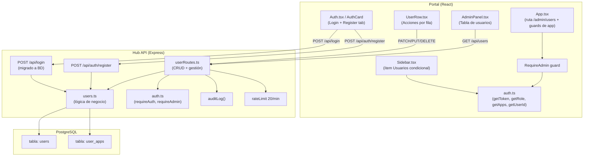
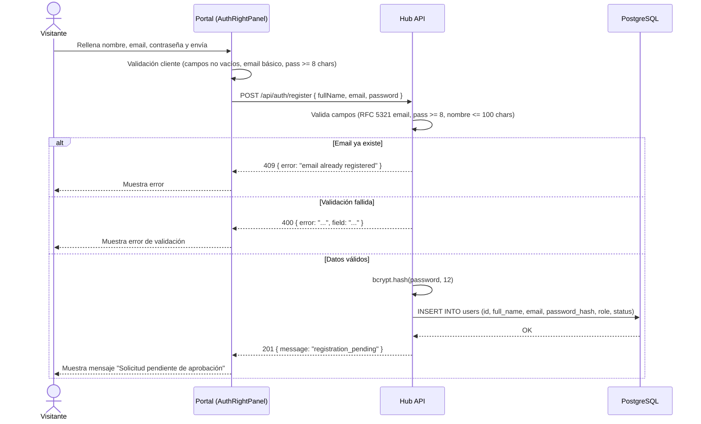
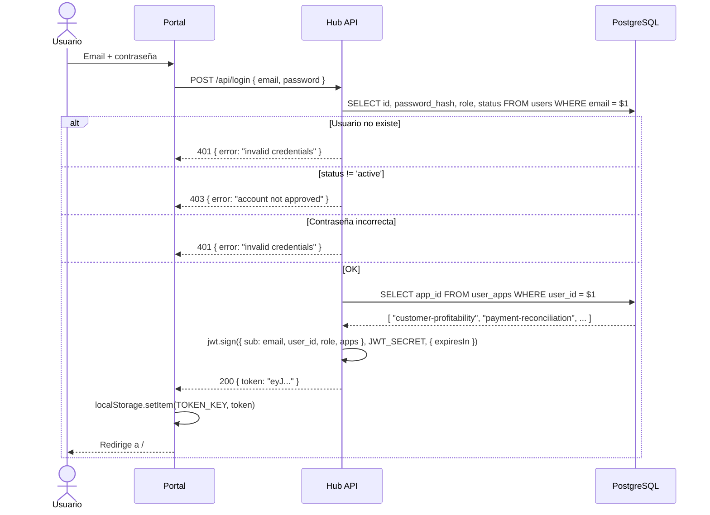
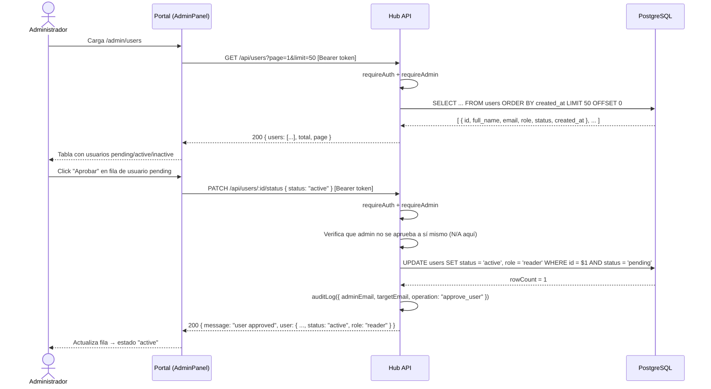

# Design Document: User Management

## Overview

El módulo `user-management` reemplaza el sistema de autenticación basado en variables de entorno (`AUTH_USERS`) por un modelo dinámico respaldado en PostgreSQL. Introduce el ciclo de vida completo del usuario: auto-registro, aprobación administrativa, asignación de rol y control granular de acceso a aplicaciones.

El sistema opera en dos capas:

- **Hub API** (`apps/hub-api`): backend Express/TypeScript que gestiona la persistencia, la autenticación y la autorización.
- **Portal** (`apps/portal`): frontend React/TypeScript que consume el JWT extendido y renderiza el Panel de Administración.

El flujo es: un visitante se registra → queda en estado `pending` → un administrador lo aprueba y asigna apps → el usuario puede loguearse y accede solo a las apps asignadas.

### Decisiones de diseño clave

- **Sin ORM**: toda la persistencia usa `pool.query()` con SQL raw, compatible con el pool `@algarpibe/zoho-sync` ya instalado.
- **Transacciones nativas**: para operaciones multi-tabla se obtiene un `client` del pool y se usa `BEGIN/COMMIT/ROLLBACK`.
- **JWT extendido**: el payload pasa de `{ sub }` a `{ sub, user_id, role, apps }`. El campo `sub` sigue siendo el email para retrocompatibilidad.
- **Rate limiting separado**: los endpoints de gestión usan un limitador de 20 req/min/IP, independiente del global de 60 req/min.
- **Audit log**: función utilitaria `auditLog()` que escribe a `console.log` en formato estructurado; sin dependencias externas.

---

## Architecture

### Diagrama de capas



### Flujo de secuencia: Registro de usuario



### Flujo de secuencia: Login con JWT extendido



### Flujo de secuencia: Aprobación de usuario por admin



---

## Components and Interfaces

### Backend: Hub API

#### `src/users.ts` — Lógica de negocio

```typescript
// Tipos exportados
export type UserStatus = 'pending' | 'active' | 'inactive';
export type UserRole   = 'admin' | 'reader';

export interface UserRecord {
  id: string;
  full_name: string;
  email: string;
  role: UserRole;
  status: UserStatus;
  created_at: string;
}

export interface UserListResult {
  users: UserRecord[];
  total: number;
  page: number;
  limit: number;
}

// Funciones exportadas
export async function registerUser(pool, { fullName, email, password }): Promise<UserRecord>
export async function listUsers(pool, { page, limit }): Promise<UserListResult>
export async function getUserById(pool, id: string): Promise<UserRecord | null>
export async function updateUserStatus(pool, id: string, status: UserStatus): Promise<UserRecord>
export async function updateUserRole(pool, id: string, role: UserRole): Promise<UserRecord>
export async function updateUserApps(pool, id: string, apps: string[]): Promise<string[]>
export async function deleteUser(pool, id: string): Promise<void>
export async function getUserApps(pool, userId: string): Promise<string[]>
export async function verifyCredentialsByEmail(pool, email: string, password: string): Promise<UserRecord | null>
```

#### `src/userRoutes.ts` — Endpoints REST

Registra las rutas bajo el prefijo `/api/users` y `/api/auth`. Aplica los middlewares `requireAuth`, `requireAdmin` y el rate limiter de gestión.

```typescript
// Firma del módulo
export function registerUserRoutes(app: express.Application, pool: Pool): void
```

#### Extensión de `src/auth.ts`

Se añaden las siguientes funciones y middlewares:

```typescript
// JWT payload extendido
export interface JwtPayload {
  sub: string;       // email (retrocompatibilidad)
  user_id: string;
  role: UserRole;
  apps: string[];
  iat: number;
  exp: number;
}

// Emite token con payload extendido
export function issueToken(user: UserRecord, apps: string[]): string

// Middleware: requiere JWT válido + role = 'admin'
export function requireAdmin(req: Request, res: Response, next: NextFunction): void

// Extrae payload del JWT (o null si inválido)
export function getPayload(req: Request): JwtPayload | null
```

#### `src/audit.ts` — Logging de auditoría

```typescript
export type AuditOperation =
  | 'register_user'
  | 'approve_user'
  | 'deactivate_user'
  | 'reactivate_user'
  | 'delete_user'
  | 'change_role'
  | 'update_apps';

export interface AuditEntry {
  timestamp: string;   // ISO 8601 UTC
  adminEmail: string;
  targetEmail: string;
  operation: AuditOperation;
}

export function auditLog(entry: AuditEntry): void
```

---

### Frontend: Portal

#### `src/auth.ts` — Extensión

Se añaden tres funciones de lectura del JWT (sin verificar firma, solo para UX):

```typescript
export function getRole(): UserRole | null
export function getApps(): string[]
export function getUserId(): string | null
```

#### `src/components/RequireAuth.tsx` — Nuevo componente `RequireAdmin`

```typescript
// Redirige a /auth si no autenticado; a / si no es admin
export function RequireAdmin({ children }: { children: ReactNode }): JSX.Element
```

#### `src/components/Sidebar.tsx` — Modificación

El botón "Usuarios" se convierte en un `<Link>` a `/admin/users` y se muestra condicionalmente solo si `getRole() === 'admin'`.

#### `src/pages/AdminPanel.tsx`

Página de gestión. Carga la lista de usuarios paginada vía `GET /api/users` y muestra la tabla con `UserRow` por fila.

Props: ninguna (usa el JWT del contexto).
Estado local: `users`, `total`, `page`, `loading`, `error`.

#### `src/components/AdminPanel/UserRow.tsx`

Fila individual de la tabla con acciones por estado:

| Estado del usuario | Acciones disponibles |
|---|---|
| `pending` | Aprobar |
| `active` | Desactivar, Cambiar rol, Asignar apps, Eliminar |
| `inactive` | Reactivar, Eliminar |

Props:
```typescript
interface UserRowProps {
  user: UserRecord;
  onStatusChange: (id: string, status: UserStatus) => void;
  onRoleChange: (id: string, role: UserRole) => void;
  onAppsChange: (id: string, apps: string[]) => void;
  onDelete: (id: string) => void;
}
```

#### `src/components/Auth/AuthRightPanel.tsx` — Modificación

La pestaña "Registrarse" se conecta al endpoint real `POST /api/auth/register`. Al recibir `201`, muestra el mensaje de aprobación pendiente en lugar de un error. No llama a `setToken()`.

#### `src/App.tsx` — Modificación

Se añade la ruta `/admin/users` protegida con `RequireAdmin`:

```tsx
<Route path="/admin/users" element={
  <RequireAdmin>
    <AdminPanel />
  </RequireAdmin>
} />
```

Las rutas de aplicaciones existentes se filtran según `getApps()`: si el usuario navega directamente a una ruta cuyo prefijo no está en `getApps()`, se redirige a `/` con una notificación visible.

---

## Data Models

### Tabla `users`

```sql
CREATE TABLE users (
  id            UUID        PRIMARY KEY DEFAULT gen_random_uuid(),
  full_name     VARCHAR(255) NOT NULL CHECK (char_length(full_name) <= 255),
  email         VARCHAR(254) NOT NULL,
  password_hash TEXT        NOT NULL,
  role          VARCHAR(10)  NOT NULL DEFAULT 'reader'
                             CHECK (role IN ('admin', 'reader')),
  status        VARCHAR(10)  NOT NULL DEFAULT 'pending'
                             CHECK (status IN ('pending', 'active', 'inactive')),
  created_at    TIMESTAMPTZ  NOT NULL DEFAULT NOW(),

  CONSTRAINT users_email_unique UNIQUE (email)
);

-- Índices
CREATE INDEX idx_users_status   ON users (status);
CREATE INDEX idx_users_email    ON users (email);
CREATE INDEX idx_users_created  ON users (created_at DESC);
```

**Campos:**

| Campo | Tipo | Descripción |
|---|---|---|
| `id` | UUID | Identificador único, generado por la BD |
| `full_name` | VARCHAR(255) | Nombre completo del usuario, máximo 255 chars |
| `email` | VARCHAR(254) | Correo electrónico único, máximo 254 chars (RFC 5321) |
| `password_hash` | TEXT | Hash bcrypt con coste mínimo 12 |
| `role` | VARCHAR(10) | `'admin'` o `'reader'` |
| `status` | VARCHAR(10) | `'pending'`, `'active'`, `'inactive'` |
| `created_at` | TIMESTAMPTZ | Timestamp de creación en UTC |

### Tabla `user_apps`

```sql
CREATE TABLE user_apps (
  user_id UUID        NOT NULL REFERENCES users(id) ON DELETE CASCADE,
  app_id  VARCHAR(80) NOT NULL,

  PRIMARY KEY (user_id, app_id)
);

-- Índice para lookup inverso (qué usuarios tienen acceso a una app)
CREATE INDEX idx_user_apps_app_id ON user_apps (app_id);
```

**Campos:**

| Campo | Tipo | Descripción |
|---|---|---|
| `user_id` | UUID | FK a `users.id`; cascade delete |
| `app_id` | VARCHAR(80) | Identificador de la aplicación, p.ej. `"customer-profitability"` |

### JWT Payload (extendido)

```typescript
// Payload firmado con JWT_SECRET
{
  sub:      "usuario@empresa.com",  // email (retrocompatibilidad)
  user_id:  "550e8400-e29b-41d4-a716-446655440000",
  role:     "reader",               // "admin" | "reader"
  apps:     ["customer-profitability", "payment-reconciliation"],
  iat:      1700000000,
  exp:      1700028800              // iat + TOKEN_TTL (por defecto 8h)
}
```

### Contratos de API

#### `POST /api/auth/register`

**Request:**
```json
{
  "fullName": "Juan Pérez",
  "email": "juan@empresa.com",
  "password": "s3cur3pass"
}
```

**Responses:**
```
201 Created
{ "message": "registration_pending", "userId": "uuid" }

400 Bad Request
{ "error": "invalid_email" | "password_too_short" | "invalid_full_name", "field": "email" | "password" | "fullName" }

409 Conflict
{ "error": "email_already_registered" }
```

#### `POST /api/login`

**Request:**
```json
{ "email": "juan@empresa.com", "password": "s3cur3pass" }
```

**Responses:**
```
200 OK
{ "token": "eyJhbGciOiJIUzI1NiIsInR5cCI6IkpXVCJ9..." }

401 Unauthorized
{ "error": "invalid credentials" }

403 Forbidden
{ "error": "account not approved" }
```

#### `GET /api/users?page=1&limit=50`

**Headers:** `Authorization: Bearer <token>` (requireAdmin)

**Response:**
```json
{
  "users": [
    {
      "id": "uuid",
      "full_name": "Juan Pérez",
      "email": "juan@empresa.com",
      "role": "reader",
      "status": "pending",
      "created_at": "2025-01-15T10:00:00.000Z"
    }
  ],
  "total": 1,
  "page": 1,
  "limit": 50
}
```

#### `PATCH /api/users/:id/status`

**Headers:** `Authorization: Bearer <token>` (requireAdmin)

**Request:**
```json
{ "status": "active" | "inactive" }
```

**Responses:**
```
200 OK  { "message": "status_updated", "user": { ...UserRecord } }
403 Forbidden  { "error": "cannot_modify_own_account" }
404 Not Found  { "error": "user_not_found" }
```

#### `PATCH /api/users/:id/role`

**Headers:** `Authorization: Bearer <token>` (requireAdmin)

**Request:**
```json
{ "role": "admin" | "reader" }
```

**Responses:**
```
200 OK  { "message": "role_updated", "user": { ...UserRecord } }
403 Forbidden  { "error": "cannot_modify_own_account" }
404 Not Found  { "error": "user_not_found" }
```

#### `PUT /api/users/:id/apps`

**Headers:** `Authorization: Bearer <token>` (requireAdmin)

**Request:**
```json
{ "apps": ["customer-profitability", "payment-reconciliation"] }
```

**Responses:**
```
200 OK  { "message": "apps_updated", "apps": ["customer-profitability", "payment-reconciliation"] }
404 Not Found  { "error": "user_not_found" }
```

#### `DELETE /api/users/:id`

**Headers:** `Authorization: Bearer <token>` (requireAdmin)

**Responses:**
```
200 OK  { "message": "user_deleted" }
403 Forbidden  { "error": "cannot_modify_own_account" }
404 Not Found  { "error": "user_not_found" }
```

---

## Correctness Properties

*A property is a characteristic or behavior that should hold true across all valid executions of a system — essentially, a formal statement about what the system should do. Properties serve as the bridge between human-readable specifications and machine-verifiable correctness guarantees.*

### Property 1: Registro crea usuario en estado `pending`

*Para cualquier* payload de registro válido (fullName no vacío ≤ 100 chars, email RFC 5321 válido, password ≥ 8 chars), la llamada a `POST /api/auth/register` debe crear un usuario cuyo `status` sea siempre `'pending'`.

**Validates: Requirements 1.2**

---

### Property 2: Hash bcrypt con coste mínimo 12

*Para cualquier* contraseña en texto plano enviada en el registro, el hash almacenado en la BD debe superar `bcrypt.getRounds(hash) >= 12`. Nunca se almacena la contraseña en texto plano.

**Validates: Requirements 1.3**

---

### Property 3: Correo duplicado siempre rechazado con 409

*Para cualquier* dirección de correo válida, si ya existe un usuario registrado con ese correo, cualquier intento de registro posterior con el mismo correo debe devolver HTTP 409, independientemente del nombre o contraseña usados.

**Validates: Requirements 1.4**

---

### Property 4: Emails inválidos siempre rechazados con 400

*Para cualquier* string que no satisfaga el formato RFC 5321 (sin `@`, dominio inexistente, caracteres no permitidos, etc.), la llamada a `POST /api/auth/register` debe devolver HTTP 400.

**Validates: Requirements 1.5**

---

### Property 5: Transiciones de estado son válidas y atómicas

*Para cualquier* usuario en estado `pending`, aplicar "aprobar" resulta en `status = 'active'`. *Para cualquier* usuario en `active`, aplicar "desactivar" resulta en `status = 'inactive'`. *Para cualquier* usuario en `inactive`, aplicar "reactivar" resulta en `status = 'active'`. Ninguna transición inválida (p.ej. `pending → inactive`) es ejecutada por la capa de negocio.

**Validates: Requirements 2.2, 2.3, 2.5**

---

### Property 6: Usuarios no activos no pueden obtener JWT

*Para cualquier* usuario cuyo `status` sea `'pending'` o `'inactive'`, cualquier intento de login con credenciales correctas debe ser rechazado con HTTP 403. Solo usuarios con `status = 'active'` obtienen un JWT.

**Validates: Requirements 2.4, 2.8**

---

### Property 7: Autoprotección del administrador

*Para cualquier* administrador autenticado, los endpoints `PATCH /api/users/:id/status` y `DELETE /api/users/:id` deben devolver HTTP 403 cuando `:id` corresponde al propio `user_id` del JWT, dejando el estado del administrador sin cambios.

**Validates: Requirements 2.7**

---

### Property 8: Aprobación asigna rol `reader` por defecto

*Para cualquier* usuario en estado `pending` que sea aprobado por un administrador, el `role` resultante debe ser siempre `'reader'`, sin importar qué administrador ejecute la aprobación ni cuándo.

**Validates: Requirements 3.1**

---

### Property 9: JWT contiene `role` y `apps` correctos para cualquier login exitoso

*Para cualquier* usuario con `status = 'active'`, el JWT emitido tras un login exitoso debe contener:
- `role`: el rol actual del usuario en la BD (`'admin'` o `'reader'`)
- `apps`: exactamente el conjunto de `app_id` registrados en `user_apps` para ese usuario (lista vacía si no tiene apps asignadas)
- `user_id`: el UUID del usuario

**Validates: Requirements 3.3, 4.3**

---

### Property 10: Round-trip de asignación de apps

*Para cualquier* usuario activo y cualquier lista de identificadores de aplicación (incluyendo la lista vacía), después de `PUT /api/users/:id/apps { apps: [...] }`, una lectura del estado del usuario debe devolver exactamente esa misma lista. La operación es idempotente: aplicar el mismo conjunto dos veces produce el mismo resultado.

**Validates: Requirements 4.1, 4.2**

---

### Property 11: `getApps()` es resistente a payloads malformados

*Para cualquier* valor del campo `apps` en el JWT que no sea un array de strings (incluyendo `null`, `undefined`, un número, un objeto, un array con elementos no-string), la función `getApps()` del portal debe devolver siempre `[]` sin lanzar excepciones.

**Validates: Requirements 4.6**

---

### Property 12: Guard de ruta bloquea apps no asignadas

*Para cualquier* ruta de aplicación cuyo prefijo no figure en el array `apps` del JWT del usuario autenticado, el guard de ruta en el Portal debe redirigir al usuario a `/` en lugar de renderizar la aplicación. Este comportamiento se aplica a todas las rutas de aplicaciones registradas.

**Validates: Requirements 4.5**

---

### Property 13: `requireAdmin` bloquea cualquier token sin rol `admin`

*Para cualquier* JWT válido cuyo payload tenga `role != 'admin'` (incluyendo `'reader'` o cualquier otro valor), cualquier endpoint protegido con `requireAdmin` debe devolver HTTP 403. Si el token es inválido o ausente, debe devolver HTTP 401.

**Validates: Requirements 2.9, 2.10, 3.5**

---

### Property 14: Audit log siempre registra los 4 campos requeridos

*Para cualquier* operación de gestión de usuarios ejecutada con éxito (approve, deactivate, reactivate, delete, change_role, update_apps), la función `auditLog()` debe emitir una entrada que contenga: `timestamp` en formato ISO 8601 UTC, `adminEmail` (email del administrador del JWT), `targetEmail` (email del usuario afectado) y `operation` (tipo de operación).

**Validates: Requirements 5.5**

---

### Property 15: Atomicidad transaccional en operaciones multi-tabla

*Para cualquier* operación que modifique simultáneamente las tablas `users` y `user_apps` (p.ej. registro + inserción de apps, o eliminación de usuario en cascada), si la segunda escritura falla, la primera también debe revertirse, preservando el estado previo de ambas tablas.

**Validates: Requirements 6.4**

---

## Error Handling

### Backend

| Situación | HTTP | Body |
|---|---|---|
| Token ausente o inválido | 401 | `{ "error": "unauthorized" }` |
| Token válido, rol insuficiente | 403 | `{ "error": "forbidden" }` |
| Admin modificando su propia cuenta | 403 | `{ "error": "cannot_modify_own_account" }` |
| Usuario no encontrado | 404 | `{ "error": "user_not_found" }` |
| Email duplicado | 409 | `{ "error": "email_already_registered" }` |
| Validación de campos | 400 | `{ "error": "...", "field": "..." }` |
| Login: cuenta no aprobada | 403 | `{ "error": "account not approved" }` |
| Login: credenciales inválidas | 401 | `{ "error": "invalid credentials" }` |
| Rate limit superado | 429 | (estándar express-rate-limit) |
| Error de BD en runtime | 500 | `{ "error": "internal error" }` |

- Los errores de BD se capturan con `try/catch` en `users.ts`; se llama a `captureError()` de Sentry y se responde con `{ error: "internal error" }`. Nunca se propaga el mensaje de error del driver al cliente.
- Las transacciones usan `client.query('ROLLBACK')` en el bloque `catch` antes de liberar el cliente con `client.release()`.
- Si `HUB_DB_URL` no está definida al arrancar, `getHubPool()` lanza y el proceso termina en < 5 segundos.

### Frontend

- Todos los fetch a la API se envuelven en `try/catch`. Los errores de red muestran "No se pudo conectar con el servidor. Reintenta."
- Los errores HTTP del servidor se extraen de `res.json().error` y se muestran en el componente.
- Si el token expira durante la sesión (detectable en la próxima petición con respuesta 401), el portal limpia el token y redirige a `/auth`.
- `getApps()` y `getRole()` devuelven valores seguros por defecto (`[]` y `null` respectivamente) si el JWT es inválido o el campo está ausente.

---

## Testing Strategy

### Approach

Se usa un enfoque de doble capa:
- **Unit/property tests** para la lógica pura (validaciones, transformaciones JWT, máquina de estados de usuarios, lógica de filtrado de apps).
- **Integration tests** para los endpoints HTTP y la interacción real con la BD.

El framework existente es **Vitest** (ya en `hub-api/package.json`). Para property-based testing se usa **fast-check**, que es compatible con Vitest y TypeScript.

### Property-Based Tests (fast-check, mínimo 100 iteraciones)

Cada test referencia su propiedad del diseño mediante un comentario de etiqueta.

```
// Feature: user-management, Property 1: Registro crea usuario en estado pending
// Feature: user-management, Property 2: Hash bcrypt con coste mínimo 12
// Feature: user-management, Property 3: Correo duplicado siempre rechazado con 409
// Feature: user-management, Property 4: Emails inválidos siempre rechazados con 400
// Feature: user-management, Property 5: Transiciones de estado válidas y atómicas
// Feature: user-management, Property 6: Usuarios no activos no pueden obtener JWT
// Feature: user-management, Property 7: Autoprotección del administrador
// Feature: user-management, Property 8: Aprobación asigna rol reader por defecto
// Feature: user-management, Property 9: JWT contiene role y apps correctos
// Feature: user-management, Property 10: Round-trip de asignación de apps
// Feature: user-management, Property 11: getApps() resistente a payloads malformados
// Feature: user-management, Property 12: Guard de ruta bloquea apps no asignadas
// Feature: user-management, Property 13: requireAdmin bloquea tokens sin rol admin
// Feature: user-management, Property 14: Audit log registra los 4 campos requeridos
// Feature: user-management, Property 15: Atomicidad transaccional en operaciones multi-tabla
```

**Ubicación de tests:**
- `apps/hub-api/src/users.test.ts` — Properties 1, 2, 3, 4, 5, 6, 7, 8, 10, 15
- `apps/hub-api/src/auth.test.ts` — Properties 9, 13
- `apps/hub-api/src/audit.test.ts` — Property 14
- `apps/portal/src/auth.test.ts` — Properties 11
- `apps/portal/src/components/AppGuard.test.ts` — Property 12

**Estrategia de aislamiento de BD para property tests:**
- Los tests de `users.test.ts` que requieren BD usan una instancia PostgreSQL en memoria (pg-mem) o un esquema de test dedicado que se limpia antes de cada test.
- Para Properties 15 (atomicidad transaccional), se usa un mock del pool que fuerza el fallo en la segunda query.

### Unit / Integration Tests

| Área | Tests |
|---|---|
| `POST /api/auth/register` | Campos vacíos, email válido, pass corta, email duplicado, registro exitoso |
| `POST /api/login` | Usuario pending, usuario inactive, contraseña incorrecta, login exitoso con JWT extendido |
| `GET /api/users` | Sin token (401), token reader (403), token admin (200 con paginación) |
| `PATCH /api/users/:id/status` | Auto-modificación (403), usuario no existe (404), transición exitosa |
| `PATCH /api/users/:id/role` | Cambio de rol exitoso, rol inválido (400) |
| `PUT /api/users/:id/apps` | Lista vacía, lista con múltiples apps, usuario no existe (404) |
| `DELETE /api/users/:id` | Auto-eliminación (403), usuario no existe (404), eliminación exitosa |
| `RequireAdmin` (Portal) | Sin token → redirect /auth, reader → redirect /, admin → render |
| `AdminPanel` (Portal) | Carga lista, muestra paginación, acciones por estado de fila |
| `getApps()` / `getRole()` (Portal) | JWT sin campo, campo null, campo malformado, campo correcto |

### Smoke Tests (startup)

- Arrancar `hub-api` sin `HUB_DB_URL` → proceso termina con mensaje de error.
- Arrancar `hub-api` con BD no alcanzable → proceso termina con mensaje de error.
- Arrancar `hub-api` sin `JWT_SECRET` → warning en log (comportamiento existente).
